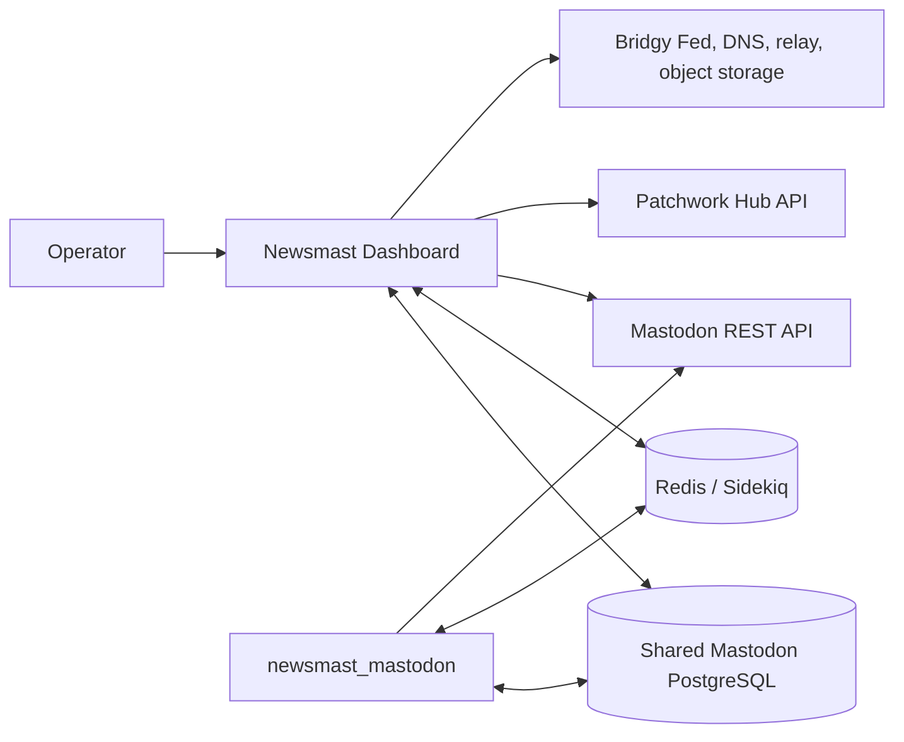

# Mastodon integration architecture

Newsmast Dashboard is a separate Rails application. It does not load `newsmast_mastodon` as a package. The two applications cooperate through documented deployment contracts.

## Contracts

| Direction | Mechanism | Verified responsibility |
| --- | --- | --- |
| Dashboard and Newsmast Mastodon | shared database | Dashboard stores channels, channel administrators, hashtags, filter keywords, server settings, collections, and related records. The gem reads/enforces its supported extensions. |
| Dashboard to host Mastodon | Mastodon REST API | Account relationships, status posting/reblogging, account/profile operations, searches, hashtag actions, relays, and other service calls use bearer tokens. |
| Dashboard to gem-enabled host | Newsmast custom API | Dashboard invokes custom account-deletion and relay behavior where the host provides it. |
| Dashboard to Patchwork Hub | Patchwork Hub API | `SyncSettingService` posts changed child settings to `/api/v1/server_settings/upsert` with the Dashboard API key/secret. Keyword filter jobs fetch Hub-managed non-custom filter groups. |
| Dashboard and jobs | Redis/Sidekiq | Scheduled filter fetches and Dashboard jobs use the configured Redis service. |
| Dashboard to external integrations | external service | Bridgy Fed, DNS provider, relay.fedi.buzz, and object storage are independently configured and optional. |

## Settings and filters

`ServerSetting` records have parent/child hierarchy. A child setting whose `value` changes is synchronized to Patchwork Hub after commit; root groups are not synchronized by this callback. Changes to the `content_filters` or `spam_filters` child setting run `KeywordFiltersJob` synchronously. When enabled, it fetches non-custom groups through the Hub API; when disabled, it removes non-custom groups for that setting.

Dashboard filter management configures data. Newsmast Mastodon owns the extended filtering and feed behavior that consumes supported shared data and Redis cache entries.

## Authentication

Browser routes use Devise sessions and Pundit authorization. `/sidekiq` requires a master administrator or `manage_sidekiq` permission. Dashboard API routes inherit `ApiController` and require `x-api-key` plus `x-api-secret` unless their controller explicitly opts into bearer-token or client-credential handling. See [Dashboard API](../api/dashboard-api.md).

## Installation and update ordering

Provision and verify the host Mastodon database and Redis first. Configure the Dashboard with access to them, run Dashboard migrations/seeds, then install or update the compatible host/gem code according to its own procedure. Run the migrations supplied by each repository in its owning deployment. This repository does not establish a guaranteed cross-repository migration order beyond those prerequisites.