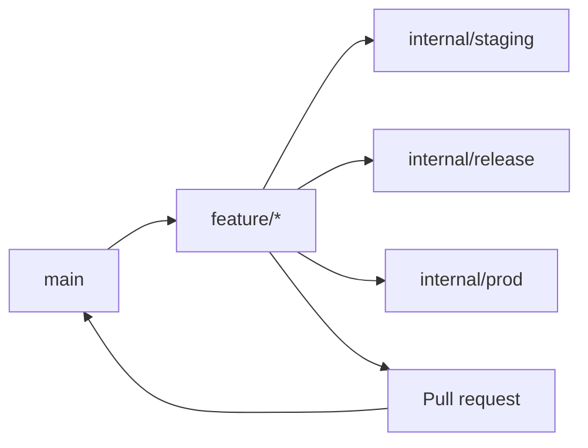

# Internal branching and merging workflow

This workflow is the reference for the internal Dashboard development team. Feature work begins from `main`; deployment promotion branches are managed targets and are not general development branches.

## Branch roles

| Branch | Purpose | Who updates it |
| --- | --- | --- |
| `main` | Approved source of truth for development. | Pull requests from feature branches. |
| `feature/*` | One scoped change, created from current `main`. | The feature team. |
| `internal/staging` | Internal staging deployment promotion target. | Authorized internal release owners. |
| `internal/release` | Internal release-candidate promotion target. | Authorized internal release owners. |
| `internal/prod` | Internal production deployment promotion target. | Authorized internal production owners. |

## Standard feature flow

1. Update local `main` and create a descriptive `feature/*` branch from it.
2. Implement the scoped change, run the relevant checks, and push the feature branch.
3. Promote the feature branch to `internal/staging` for internal testing when a staging deployment is needed.
4. Promote the same reviewed feature branch to `internal/release` when preparing a release candidate.
5. Promote the same reviewed feature branch to `internal/prod` only through the production release process.
6. Open a pull request from `feature/*` to `main`. Complete review and required checks before merging it.

## Merge and promotion rules

- Do not develop directly on `main`, `internal/staging`, `internal/release`, or `internal/prod`.
- Keep each feature branch focused. Resolve conflicts against current `main` before the pull request is merged.
- Treat each `internal/*` branch update as a controlled deployment promotion. Verify the target environment after promotion.
- A production promotion does not replace the pull request: merge the feature branch into `main` through its reviewed PR so the approved source remains the permanent record.
- Use the repository pull-request template and record the feature branch, validation, and deployment impact.